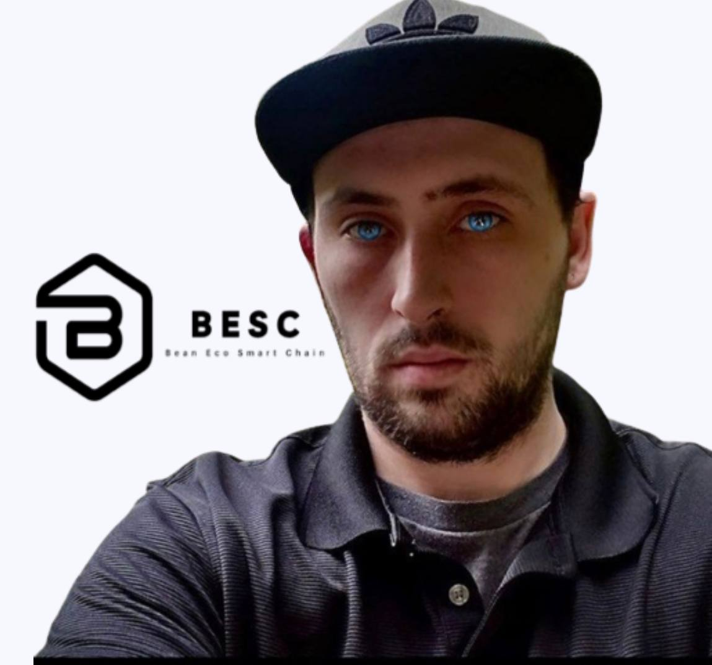

# BESC Assembly

BESC Assembly is a governance body formed from particularly active members of the BESC community. Its formation is the first step in transitioning full governance and ownership over the BESC platform to the community.

Currently, BESC Assembly consists of five BESC ecosystem members independent from BESC Foundation who have shown consistent dedication and commitment to the project, and already have a voice within the community.

BESC Assembly's **current role includes the following**:

* implementing the Snapshot voting mechanism on BESC; and
* managing the Community Token Pool.

## Community Token Pool

BESC Assembly's budget will be initially constituted by the **Community Token Pool**. Each month, **20,000 BESC** will be allocated to it from the BESC Bootstrap Pool).

BESC Assembly will regularly distribute the Community Token Pool funds to finance grants, bounties, marketing, and other initiatives designed to serve communities building on the platform and drive innovation.

## Current Assembly members

### **1. Brian Nichols** 

_**CEO (Founder)**_

<figure><figcaption></figcaption></figure>
