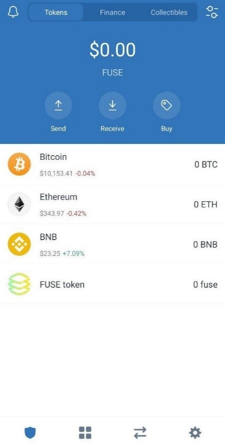

# Trust wallet tutorial

This guide has been prepared using Trust wallet version **1.15.5** on Android. 

**Step 1:** Open Trust wallet on your phone and you should see the interface as shown below. 

**Step 2:** Press the top corner button on the right hand side which will take you to the interface as shown in the below image. Scroll down to see **“Add Custom token”**.

**Step 3:** Make sure the network is selected as **“BSC or BESC”** and enter the BESC contract details as mentioned below.

**Wrapped BESC**:

Contract address - **0x5E3344216aDb2C19caa7F3Fe90078E7C4ac71bb6**

Name - **BESC token**

Symbol - **BESC**

Decimals - **18**

**Step 4:** You have added **BESC** successfully on your Trust wallet and now you should see **BESC** on your main page as shown below.

Now let’s learn how to Send/Receive **BESC** on Trust wallet.

**To receive BESC:** Once completing Steps 1-4, Press on **BESC token** in the main page of your wallet and you should see the Send/Receive button as shown below. Now click on **“Receive”** and your **BESC token** address \(Public key\) will appear to which you can send BESC. Once the transaction is confirmed on-chain the BESC balance will be shown.

**To send BESC:** Press “**BESC token”** on the main page of your wallet and you will see **“Send/Receive”** button as shown below. Now click **“Send”** which will take you to the next page where you need to enter the **“Recipient Address”** to which you want to send **BESC** to and the **“Amount”** then click **“Continue”.** You can adjust the gas fees according to the Ethereum network gas prices and confirm the transaction.

We hope this tutorial helped you to use MEW and send/receive BESC tokens. Until next time friends!

